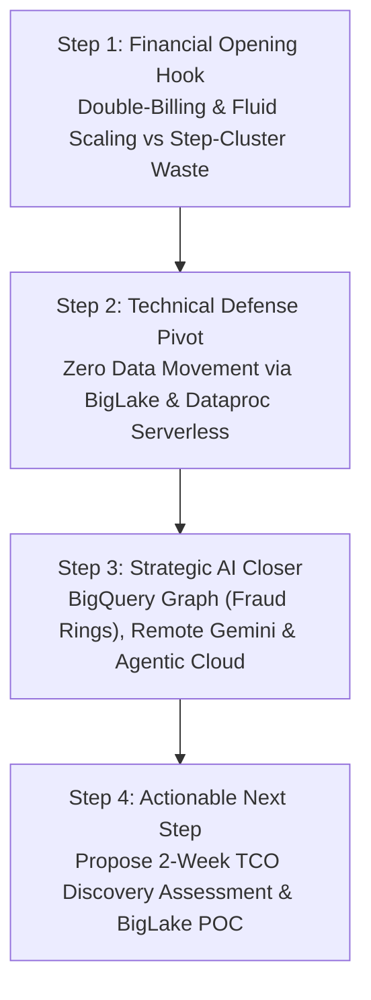

# Databricks Deposition & BigQuery Technical Battlecard
**Conversation Checklist & Probing Questions for Architecture & Sales Engineering**  
*Curated by pedropm@google.com | Updated with BigQuery Graph & BigQuery Fluid Scaling*

This document provides an exhaustive, field-tested conversational checklist to systematically deposition Databricks and position **Google BigQuery** (enhanced with Next '26 **Agentic Data Cloud**, **BigQuery Graph**, and **Fluid Scaling** capabilities) as the superior, future-proof Data & AI platform for massive marketplace data opportunities at Adevinta.

---

## Executive Strategy & Customized Meeting Playbook (Hybrid FinOps + Architecture)

When leading a Databricks takeout conversation before a mixed executive table (FinOps/C-Level + Data Architecture Leads at Adevinta), follow this rigorous 4-step conversational choreography to disarm technical defensiveness while winning financial sponsorship:

### 1. The Opening Hook: Financial Transparency & Fluid Scaling vs. Step-Scaling (FinOps Focus)
* **The Goal:** Immediately capture C-level and FinOps attention by exposing Databricks' structural cost inefficiencies without directly attacking the technical team's coding capabilities.
* **Key Script Tone:** *"We are not here to debate SQL vs. Spark syntax; we are here to audit why your data platform invoice continues to compound due to structural vendor double-billing and rigid cluster step-scaling waste."*
* **Primary Darts:**
  - Emphasize that Databricks licenses (**DBUs**) are billed directly on top of active cloud VMs (AWS/GCP/Azure), creating an opaque compound cost equation.
  - Highlight that BigQuery leverages **Fluid Scaling**—an ultra-responsive compute reservation engine that dynamically adjusts slot capacity in real-time at sub-second granularity. Contrast this with Databricks' step-scaling, where rigid VM node blocks force overprovisioning during peak marketplace concurrency and charge for idle cooldown windows.

### 2. The Technical Olive Branch: Zero Data Movement & Zero Cluster Management (Architect Focus)
* **The Expected Objection:** *"We have hundreds of terabytes in Delta Lake Parquet format across leboncoin and Mobile.de with thousands of Apache Spark ETL scripts. A database migration would cause massive disruption and require an army of developers."*
* **The Technical Rebuttal:** Propose an immediate **Zero-Copy & Hybrid Transition Strategy**:
  - **Storage Compatibility:** Demonstrate how **Google BigLake** queries existing Delta Lake and Apache Iceberg tables directly inside their current buckets (GCS/S3/ADLS) with native high-speed performance and unified IAM row/column security. **Zero physical data duplication or ingestion is required in Phase 1.**
  - **Compute Offloading:** For existing complex Spark jobs that cannot be immediately refitted to declarative SQL/dbt, migrate execution directly to **Dataproc Serverless**. Powered by the Cloud Next '26 **Lightning Engine for Apache Spark**, Dataproc runs up to **4.5x faster** than open-source alternatives with **2x better price-performance**—entirely eradicating DevOps cluster administration and warm-up lags.

### 3. The AI Differentiation Closer: BigQuery Graph & Next '26 Agentic Data Cloud
* **The Goal:** Answer the executive question: *"How does this migration future-proof us against Databricks' Data Intelligence Platform in our classifieds marketplaces?"*
* **The Technical Rebuttal:** Show that Databricks forces structured enterprise data into complex notebook integration chains or external graph databases (e.g., Neo4j, GraphFrames) to serve Generative AI and relationship mapping. Contrast this with Google's native **Agentic Data Cloud**:
  - **BigQuery Graph Analytics (SQL/PGQ):** Analysts can construct and query multi-hop Property Graphs directly in standard SQL without data leaving the analytical engine. For Adevinta, this instantly maps user interaction networks to uncover multi-account **Fraud Rings and Scams** (connecting shared device fingerprints, IPs, and listing phrasing) in milliseconds.
  - **Deep Research Agent Integration:** Gemini Enterprise Deep Research Agents connect **directly to BigQuery tables** out of the box. Autonomous agents dynamically synthesize structured operational analytics with unstructured enterprise SaaS documents, reasoning over ad monetization and user conversions with real-time verifiable citations.

---

## Pillar 1: True Serverless Fluid Scaling vs. VM-Based Cluster Toil

> [!WARNING]
> **Databricks Vulnerability:** Despite branding around "Serverless SQL Warehouses" and the Data Intelligence Platform, Databricks remains fundamentally coupled to spinning up, sizing, and step-scaling virtual machine (VM) clusters in the cloud provider's IaaS layer.

### Conversational Probing Questions

- [ ] **On Fluid Scaling vs. Rigid Step-Scaling:**  
  *"When traffic on Mobile.de or leboncoin surges, how does Databricks scale compute? Are your analysts trapped waiting for coarse physical compute units or new VM nodes to spin up? Why pay for rigid 'step-scaling' blocks when your queries only need precise incremental capacity?"*
  - **Pain Point Exposed:** Step-function cluster scaling creates latency jumps and billing waste during unpredictable traffic spikes.
  - **BigQuery Technical Pivot:** Contrast with BigQuery’s **Fluid Scaling** architecture over disaggregated Dremel + Colossus. BigQuery dynamically flexes processing slots in sub-second increments according to exact query complexity and concurrency needs—guaranteeing **zero cold starts**, smooth elasticity, and zero overprovisioning payment.

- [ ] **On Cold Starts & Elasticity:**  
  *"When your analysts start working in the morning or when an unpredictable programmatic ad bidding aggregation triggers, how long do your BI tools hang waiting for Databricks SQL Warehouses to warm up? Are you experiencing 2 to 7-minute cold starts simply because physical VMs must boot under the hood?"*
  - **Pain Point Exposed:** Queuing delays and poor executive BI user experience caused by physical node provisioning.
  - **BigQuery Technical Pivot:** BigQuery maintains a global warm pool of elastic compute slots interconnected via the **Jupiter Network (1+ Tbps per rack)**. Compute is allocated instantaneously in milliseconds.

- [ ] **On Operational DevOps Toil & Spark Sizing:**  
  *"How much engineering bandwidth does your data platform team waste on low-level sizing decisions—such as selecting memory-optimized vs. compute-optimized VM instances, configuring min/max scaling nodes, tuning JVM Garbage Collection, or resolving Out-Of-Memory (OOM) errors in Apache Spark?"*
  - **Pain Point Exposed:** High reliance on scarce, expensive DevOps/Spark talent just to keep pipelines stable.
  - **BigQuery Technical Pivot:** BigQuery is **true multi-tenant serverless**. Infrastructure maintenance, memory management, dynamic memory shuffling, and scaling are completely abstracted. Engineers focus exclusively on business logic and marketplace AI modeling.

---

## Pillar 2: FinOps Opacity, Double-Billing & TCO

> [!IMPORTANT]
> **Databricks Vulnerability:** Databricks relies on a fragmented, highly opaque cost model where customers pay twice: once to Databricks for software licenses (Databricks Units / DBUs) and once to the underlying cloud provider (AWS/GCP/Azure) for virtual machines, root networking, and EBS volumes.

### Conversational Probing Questions

- [ ] **On the "Double-Billing" Equation & Idle Compute:**  
  *"If a Databricks interactive cluster or SQL Warehouse is set to auto-terminate after 20 minutes of inactivity, are you comfortable paying both Databricks (for DBUs) and your cloud provider (for active VMs) during those 20 minutes of zero productive processing?"*
  - **Pain Point Exposed:** Financial waste from idle resources waiting to power down.
  - **BigQuery Technical Pivot:** In BigQuery, **idle compute cost is literally $0**. With **Fluid Scaling** under Capacity Editions, assigned processing slots dynamically shrink to exact operational minimums or zero when queries finish, shutting off billing instantly.

- [ ] **On TCO Unpredictability & Cost Estimation:**  
  *"Before executing a complex exploratory query or experimental pipeline in Databricks, how do your data scientists accurately predict the exact cost in DBUs and VM billing? Can they perform a zero-cost dry run?"*
  - **Pain Point Exposed:** Total price opacity until the end-of-month cloud invoice arrives.
  - **BigQuery Technical Pivot:** BigQuery allows instant, **zero-cost dry runs** (`--dry_run`) that calculate the precise number of bytes a query will process before spending a single cent, providing complete financial control and governance.

> [!TIP]
> **Real-World Competitive Proof Point:** Reference enterprise migration benchmarks—such as **J.B. Hunt achieving a verified 60% TCO reduction** after taking out Databricks and consolidating on BigQuery due to eliminating idle cluster sprawl, double-billing, and leveraging Capacitor storage compression (3x-5x reduction).

---

## Pillar 3: Open Lakehouse & Storage Lock-In

> [!CAUTION]
> **Databricks Vulnerability:** Databricks aggressively markets "Open Lakehouse" through Delta Lake, but intentionally builds proprietary dependencies around their closed-source **Photon** execution engine and cumbersome asynchronous format translation (**UniForm**).

### Conversational Probing Questions

- [ ] **On Small Files & Manual Storage Maintenance:**  
  *"With frequent micro-batches or streaming listing ingestion in Delta Lake, how much operational friction is spent running periodic manual `OPTIMIZE`, `VACUUM`, and `Z-ORDER` commands to prevent read degradation from small file proliferation?"*
  - **Pain Point Exposed:** Storage decay and silent degradation of BI performance without constant manual housekeeping.
  - **BigQuery Technical Pivot:** BigQuery performs automated physical file compaction, metadata pruning, and automatic table clustering in the background **asynchronously and for completely free**, with zero cron scheduling required.

- [ ] **On Delta Lock-In vs. Apache Iceberg Standardization:**  
  *"As the global data industry converges heavily on **Apache Iceberg** as the universal open table format, why settle for Databricks' **UniForm**—which generates Iceberg metadata asynchronously, adding latency and risking out-of-sync reads for external table engines?"*
  - **Pain Point Exposed:** Artificial friction and stale data exposure when non-Databricks engines attempt to read Delta tables via UniForm.
  - **BigQuery Technical Pivot:** Position **BigQuery Managed Tables for Apache Iceberg** and **BigLake**. BigQuery reads and writes natively to Apache Iceberg across GCP, AWS, and Azure with zero data movement (**Cross-Cloud Lakehouse**), achieving high-speed performance comparable to native tables via metadata acceleration and the BigQuery Storage API.

---

## Pillar 4: Governance & The "Integration Tax"

> [!NOTE]
> **Databricks Vulnerability:** **Unity Catalog** acts as a redundant, secondary governance layer. Integrating Cloud-native tools (like Vertex AI, Looker, or enterprise security scanners) forces engineering teams to build complex federated connections, synchronize token translators, and duplicate IAM access controls.

### Conversational Probing Questions

- [ ] **On Security Duplication & Unity Catalog Silos:**  
  *"Why maintain two distinct organizational security structures—your cloud provider's native Identity and Access Management (Cloud IAM) plus Databricks Unity Catalog? How do you ensure synchronization without creating security gaps or compliance failure points under GDPR / SOX?"*
  - **Pain Point Exposed:** Admin overhead and compliance risks from maintaining duplicate access control lists.
  - **BigQuery Technical Pivot:** BigQuery relies directly on **Cloud IAM** and **Google Dataplex (Universal Catalog)**. Access controls (column-level, row-level security, and dynamic data masking) are defined once at the cloud layer and applied universally across SQL, AI, and visualization tools.

- [ ] **On End-to-End Lineage Across Ecosytem Tools:**  
  *"Does Unity Catalog provide out-of-the-box, comprehensive automated lineage that traces data from raw Pub/Sub or ingestion pipelines, through data warehouse SQL transformations, directly into Looker dashboards and Vertex AI machine learning models—without writing custom SDK scripts?"*
  - **Pain Point Exposed:** Lineage visibility stops at the boundary of Databricks notebooks and Spark jobs.
  - **BigQuery Technical Pivot:** Dataplex and BigQuery automatically capture granular, end-to-end data lineage across the entire lifecycle (Ingestion -> Warehousing -> BI Visuals -> AI Model Training) natively.

---

## Pillar 5: AI Democratization, BigQuery Graph & Agentic Data Cloud

> [!TIP]
> **Databricks Vulnerability:** Databricks revolves around a code-heavy, notebook-centric workflow optimized for Spark engineers and specialized data scientists, marginalizing SQL-first business analysts from driving AI, generative AI, graph analytics, and autonomous agent workflows.

### Conversational Probing Questions

- [ ] **On BigQuery Graph Analytics vs. External Graph ETL (Fraud Ring & Trust Strategy):**  
  *"To uncover organized fraud rings across buyer and seller accounts on leboncoin or Milanuncios, how do you perform graph pattern matching today? Are your engineers forced to extract tables into complex Spark GraphFrames or synchronize with external graph databases like Neo4j, introducing network latency and operational vulnerability?"*
  - **Pain Point Exposed:** Exporting sensitive transactional data out of analytical storage into specialized graph DBs or writing intricate Python graph code slows down fraud interception and violates zero-copy security.
  - **BigQuery Technical Pivot:** Introduce **BigQuery Graph Analytics (SQL Property Graph Queries - PGQ)**. Adevinta analysts can construct graph schemas and execute multi-hop network traversals directly over existing classifieds tables using standard SQL. Teams can detect complex fraud rings (connecting shared IP addresses, device cookies, bank routing numbers, and suspicious messaging templates) in milliseconds with **zero data movement**.

- [ ] **On AI Democratization for SQL Teams:**  
  *"Why force data out of your data warehouse into Spark notebooks just to run Machine Learning? How do your SQL-oriented business analysts currently build, evaluate, and operationalize predictive models or LLM generative transformations without learning Python or Spark?"*
  - **Pain Point Exposed:** Exclusion of domain expert data analysts from AI workflows and unnecessary data movement between analytical storage and ML experimentation clusters.
  - **BigQuery Technical Pivot:** Showcase **BigQuery ML (BQML)** and **BigQuery Studio**. Analysts can build XGBoost, ARIMA+ time series, K-means, and Deep Learning models directly within standard SQL. Using `ML.GENERATE_TEXT`, analysts can invoke native **Gemini LLMs** and vector embeddings without data leaving BigQuery.

- [ ] **On Autonomous Agents & Next '26 Agentic Data Cloud:**  
  *"How is your platform preparing for AI agent orchestration? Can your intelligent agents dynamically query structured warehouse tables, correlate them with unstructured corporate documents, and synthesize enterprise answers with real-time verifiable citations?"*
  - **Pain Point Exposed:** Databricks requires custom integration chains and external AI model hosting to bridge enterprise structured data with generative LLM agents.
  - **BigQuery Technical Pivot:** Introduce Google Cloud's **Agentic Data Cloud (Next '26)**:
    - **Deep Research Agent Connection:** Direct native binding between Gemini Enterprise Deep Research Agents and BigQuery, enabling autonomous synthesis of structured analytics and unstructured SaaS docs for root-cause enterprise analysis with verifiable citations.
    - **Data Agent Kit:** Gemini-powered conversational data engineering and science authoring across Python, Spark, and SQL.
    - **Knowledge Catalog & Smart Storage:** Constructs dynamic semantic context graphs and uses Object Context APIs for automated metadata tagging in GCS.
    - **Lightning Engine for Apache Spark:** For workloads requiring Spark, Google’s Lightning Engine executes **up to 4.5x faster** than standard open-source alternatives with **2x better price-performance**.

---

## Pillar 6: Concurrency, Real-Time BI & Fluid Scaling under Peak Loads

### Conversational Probing Questions

- [ ] **On Peak Monday Morning Dashboard Concurrency & Ad Tech Bidding:**  
  *"When hundreds or thousands of corporate business users log into Looker or PowerBI concurrently on Monday mornings, or when automated advertising bidding engines query listing traffic, how does Databricks handle the concurrency spike? Does it force queries into virtual queues while waiting for new physical cluster nodes to autoscale?"*
  - **Pain Point Exposed:** Degradation of dashboard performance during peak organization concurrency due to VM step-scaling latency.
  - **BigQuery Technical Pivot:** Highlight **BigQuery BI Engine** and **Fluid Scaling**. BI Engine provides an integrated, zero-config, ultra-fast in-memory analysis layer that automatically accelerates Looker and reporting queries to consistent **sub-second response times** under massive concurrent workloads. Combined with Fluid Scaling, BigQuery dynamically redistributes memory and compute capacity instantaneously without cluster boundaries or caching management toil.

---

## Summary Battlecard: Databricks vs. BigQuery Technical Scorecard

| Evaluation Dimension | Databricks (Data Intelligence Platform) | Google BigQuery & Agentic Data Cloud (pedropm@google.com) |
| :--- | :--- | :--- |
| **Compute Elasticity** | **Rigid Step-Scaling on VMs:** Adds physical compute units in coarse blocks; suffers 2–7 min cold boots and queuing lags. | **Fluid Scaling (Disaggregated):** Dynamically allocates capacity slots at sub-second granularity without cold starts or queuing. |
| **Billing & Idle Cost** | **Double-Billing + Idle Waste:** Pays DBU licenses + Cloud VMs. Continues billing until idle cooldown timers expire. | **Single-Vendor Zero-Idle:** Pays exclusively for scanned bytes or assigned Capacity Editions ($0 cost at rest). |
| **Graph & Network Analysis** | **Code-Intensive (GraphFrames / External DB):** Requires extracting data to Neo4j or coding complex Python Spark graph jobs. | **Native BigQuery Graph (SQL/PGQ):** Traverse multi-hop Property Graphs directly in SQL to detect fraud rings with $0 data movement. |
| **Table Maintenance** | **Manual / Scheduled:** Requires active scripting of `OPTIMIZE`, `VACUUM`, and `Z-ORDER` to fix small file rot. | **Fully Automated:** Background file compaction, metadata indexing, and clustering executed automatically for free. |
| **Open Lakehouse** | **Delta-Centric + Closed Photon:** Relies on asynchronous UniForm translation for Iceberg; fast SQL locked to closed-source Photon. | **Native Apache Iceberg + BigLake:** Unified zero-copy multi-cloud Lakehouse (GCP/AWS/Azure) with high-speed open storage APIs. |
| **Data Governance** | **Siloed (Unity Catalog):** Secondary metadata platform requiring synchronization with Cloud IAM and custom lineage SDKs. | **Universal (Dataplex + IAM):** Unified cloud IAM identity, dynamic data masking, and automated end-to-end lineage. |
| **AI / GenAI Integration** | **Code-Centric (MLflow / Notebooks):** Excludes SQL analysts; requires migrating data to Spark clusters for ML model training. | **Native SQL & Agentic AI:** BQML, Gemini Studio Code Assist, and direct integration with Next '26 Deep Research Agents. |

---

## Recommended 3-Phase Takeout Roadmap for Customers

When proposing a replacement strategy (Takeout) to an engineering team accustomed to Spark and notebooks, present a phased, low-risk consolidation roadmap:

1. **Phase 1: TCO Discovery, Fluid Scaling Simulation & BI Consolidation (Months 0–4)**
   - Conduct an audit of the customer's real DBU + Cloud VM billing to reveal idle waste and step-scaling overprovisioning.
   - Simulate **Fluid Scaling** and migrate intermittent, ad-hoc, and highly concurrent BI/Reporting workloads directly to BigQuery to deliver immediate, demonstrable TCO reduction (targeting up to 60% savings).
2. **Phase 2: Open Lakehouse, BigQuery Graph & Batch Modernization (Months 4–12)**
   - Implement **BigLake** over existing object storage buckets (GCS/S3/Azure) with zero data duplication.
   - Transition legacy Delta tables to **BigQuery Managed Tables for Apache Iceberg**.
   - Convert standard ETL pipelines to declarative SQL/dbt in BigQuery; replace legacy GraphFrames fraud detection scripts with native **BigQuery Graph SQL queries**.
   - Move highly complex legacy Spark jobs to **Dataproc Serverless** (using the **Lightning Engine for Spark**).
3. **Phase 3: AI Unification & Full Consignment (Months 12–18)**
   - Consolidate predictive modeling and generative AI in **Vertex AI** and **BQML**.
   - Connect BigQuery tables to **Gemini Deep Research Agents** (Next '26) and Dataplex Knowledge Catalog for autonomous organizational data intelligence.
   - Formally sunset remaining Databricks workspaces and eliminate vendor double-billing.
