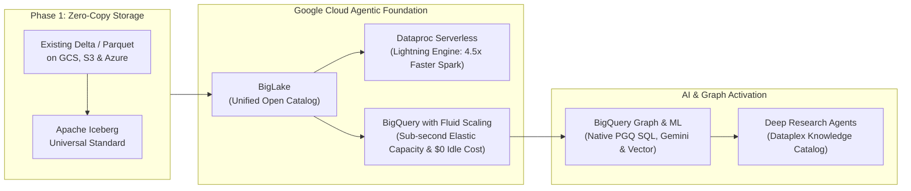
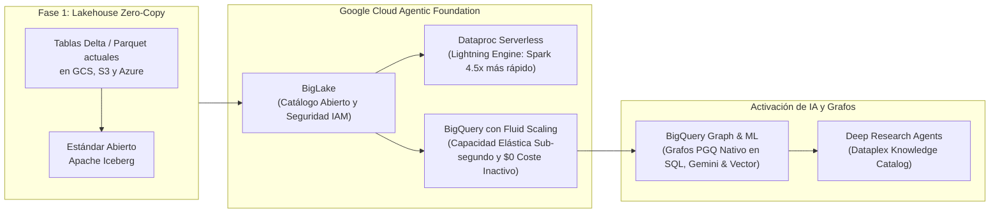

# Adevinta Data Foundation & Databricks Takeout Presentation Deck
**Powering Europe's Leading Marketplaces with BigQuery Graph, Fluid Scaling, & the Next '26 Agentic Data Cloud**  
*Comprehensive Slide Deck Framework & Speaker Notes (English & Español)*

---

# PART 1: ENGLISH PRESENTATION SLIDES

## SLIDE 1: Title Slide
### **Building the Agentic Data Foundation for Europe's Leading Marketplaces**
**Transitioning Adevinta to BigQuery Fluid Scaling & Native Graph Analytics**

* **Target Audience:** Adevinta C-Level (FinOps, CTO, CIO), Enterprise Data Architects, & AI Engineering Leads
* **Key Focus:** BigQuery Graph Analytics, Fluid Scaling Elasticity, Zero-Copy Lakehouse, & Databricks TCO Optimization

---

## SLIDE 2: The Strategic Opportunity
### **Unleashing Adevinta’s Massive Marketplace Asset**
*From Static Classifieds to Proactive, AI-Driven Commerce*

* **The Continental Footprint:** Powering European leaders across automotive, real estate, employment, and classifieds (*leboncoin, Kleinanzeigen, Mobile.de, Milanuncios, InfoJobs*).
* **The Data Asset:** Billions of user interactions, real-time clickstreams, multimedia property/vehicle photos, conversational seller chats, and multi-hop account networks.
* **The AI Mandate:** Winning the next decade of digital classifieds requires moving beyond historic dashboards toward **Agentic AI Marketplaces**, relationship graphs, and hyper-personalized monetization.

> **Speaker Notes:** *"Welcome team. Adevinta sits on one of the most valuable behavioral and transaction datasets in Europe. But to capture the next wave of value—such as autonomous AI buyer assistants and instant graph-based fraud ring detection—your data platform cannot remain constrained by legacy cluster infrastructures."*

---

## SLIDE 3: The Infrastructure Ceiling
### **Why Traditional Lakehouses (Databricks) Inflate TCO & Slow AI**
*Exposing Step-Scaling Waste, Double-Billing, & Graph Extraction Toil*

* **Rigid Step-Scaling & Idle Waste:** Customers pay twice—for Databricks licenses (**DBUs**) and underlying cloud VMs. Step-scaling adds compute in coarse VM node blocks, creating queuing delays during traffic peaks and paying for un-productive "ghost compute" during cooldown timers.
* **Graph & AI "Integration Tax":** Uncovering multi-account fraud rings or invoking LLMs forces engineers to extract structured warehouse tables into complex Spark GraphFrames, external graph databases (Neo4j), or asynchronous converters (**UniForm**)—increasing latency and security exposure.
* **Governance Silos:** Managing **Unity Catalog** alongside native Cloud IAM creates administrative duplication, hindering seamless compliance under EU Data Sovereignty and the EU AI Act.

> **Speaker Notes:** *"When we analyze why legacy platform invoices continue to climb without proportional AI acceleration, we see structural flaws. Databricks forces you into an opaque compound cost model where step-scaling VM clusters overprovision compute during traffic peaks, while requiring code-heavy extraction pipelines just to run graph analytics or generative AI."*

---

## SLIDE 4: The Google Cloud Solution
### **Next '26 Agentic Data Cloud with Fluid Scaling**
*An Elastic, Zero-Copy Enterprise Foundation*

* **BigQuery Fluid Scaling:** Revolutionary compute resource provisioning that flexes capacity slots in sub-second increments precisely matched to real-time query load—completely eliminating rigid cluster boundaries, boot delays, and step-scaling overprovisioning.
* **Zero-Copy Lakehouse:** **Google BigLake** queries existing Delta Lake and Apache Iceberg files directly in current buckets with unified IAM governance—**zero physical data movement required**.
* **Serverless Spark Acceleration:** **Dataproc Serverless** powered by the Next '26 **Lightning Engine** runs up to **4.5x faster** than open-source alternatives with **2x better price-performance**, eliminating DBU premiums entirely.

> **Speaker Notes:** *"Google Cloud solves this through our Next '26 Agentic Data Cloud equipped with BigQuery Fluid Scaling. We don't ask you to undertake a risky migration; with BigLake, we query your existing Delta Lake tables directly in your buckets with zero duplication. And Fluid Scaling allocates processing power dynamically in sub-second granularity without cold starts or paying for idle VM blocks."*

---

## SLIDE 5: Unified Data, Graph, & AI Superhighway
### **Democratizing Advanced AI & Graph Analytics Across SQL Teams**
*No Data Egress. Native Graph Traversals & Multimodal AI Directly at the Storage Layer.*

* **Native BigQuery Graph (SQL Property Graph Queries - PGQ):** Domain experts and analysts can construct and traverse multi-hop network graphs directly in standard SQL without data egress to tools like Neo4j or GraphFrames. Map user behavior and fraudulent account rings instantaneously.
* **BigQuery ML & Remote Models:** SQL-first analysts can operationalize state-of-the-art **Gemini 1.5/2.0 LLMs**, multi-modal vision classifiers, and automated forecasting using simple declarative SQL (`ML.GENERATE_TEXT`).
* **Next '26 Deep Research Agents:** Deploy autonomous agents grounded in Dataplex's **Knowledge Catalog** to reason across structured tables and unstructured marketplace media with verifiable citations.

> **Speaker Notes:** *"Instead of exporting sensitive transaction tables out of your secure warehouse into experimentation notebooks or graph databases, Google brings Graph Analytics and GenAI directly to the data. Any domain analyst at Adevinta can traverse multi-hop fraud networks using standard SQL Property Graph syntax or invoke Gemini large language models in milliseconds."*

---

## SLIDE 6: Adevinta AI Marketplace Use Cases
### **Driving ROI Across Core Marketplace Drivers**
*High-Impact Enhancements Powered by BigQuery Graph & Fluid Scaling*

| Marketplace Domain | AI & Graph Innovation | Powered by Google Cloud Foundation | Adevinta Business Impact |
| :--- | :--- | :--- | :--- |
| **Trust & Safety** | **Organized Fraud Ring Interception** | **BigQuery Graph (PGQ) + Gemini Vision:** Multi-hop SQL graph traversals linking shared IP addresses, device cookies, bank accounts, and image manipulation in real-time. | Eliminates manual review bottlenecks; dismantles sophisticated scam networks across leboncoin & Milanuncios before listings go live. |
| **Ad Tech & Monetization** | **Algorithmic Dynamic Yield Pricing** | **BigQuery Fluid Scaling + BI Engine:** Sub-second elastic compute slot scaling that adjusts instantly to morning dealer traffic spikes and programmatic bidding. | Maximizes ad monetization ROI for commercial partners; optimizes visibility tier pricing without cluster overprovisioning costs. |
| **Conversational Commerce** | **Autonomous Buyer/Seller Copilots** | **BigQuery Vector Search + Gemini:** Sub-second semantic search matching user intent across millions of automotive & real estate listings. | Boosts conversion rates; shortens time-to-sale with automated descriptions, semantic appraisals, and smart buyer matching. |

> **Speaker Notes:** *"Here is how BigQuery Graph and Fluid Scaling drive bottom-line marketplace growth. Whether it is intercepting complex fraud rings on leboncoin via multi-hop SQL graph queries, powering real-time dynamic ad bidding on Mobile.de with elastic sub-second Fluid Scaling, or generating conversational shopping copilots, Google Cloud powers it without friction."*

---

## SLIDE 7: Proven Takeout Roadmap & FinOps Value
### **A Low-Risk, High-Impact 4-Phase Transition Strategy**
*Eliminate Step-Scaling Waste and Achieve up to 60% TCO Savings (e.g., J.B. Hunt Benchmark)*

1. **Phase 1: Financial Discovery & Fluid Scaling Simulation (Weeks 1–2):** Run zero-cost dry-run evaluations (`--dry_run`); attach existing GCS/S3 Delta tables via BigLake with **$0 data migration cost**.
2. **Phase 2: Graph Modernization & Serverless Spark Offloading (Weeks 3–6):** Replace legacy GraphFrames fraud scripts with native **BigQuery Graph SQL**; move heavy Spark ETL to Dataproc Serverless (Lightning Engine).
3. **Phase 3: AI Democratization & Lineage (Weeks 7–10):** Activate SQL-native Gemini models for Trust & Safety and Copilots; configure unified Dataplex lineage from ingestion to Looker dashboards.
4. **Phase 4: Agentic Data Cloud Consolidation (Ongoing):** Launch enterprise Deep Research Agents; complete DBU license decommissioning and lock in **50%–60% structural cloud TCO savings**.

> **Speaker Notes:** *"Our transition roadmap is designed to prove financial value within the first fourteen days. We mount your open tables without copying a single byte, modernize fraud detection with BigQuery Graph SQL, offload high-cost Spark workloads to serverless execution, and systematically decommission expensive DBU licenses—cutting global TCO by up to 60%."*

---

## SLIDE 8: Next Steps & Call to Action
### **Validating the Value at Adevinta**
*Recommended Initial Engagements for Architecture & FinOps Teams*

* **1. FinOps Audit & Fluid Scaling Workshop:** Schedule a 2-week non-intrusive billing assessment to quantify exact budget wasted on Databricks DBUs, rigid VM step-scaling, and idle cluster warm-up lags.
* **2. 5-Day Zero-Copy BigLake & Graph POC:** Mount a representative subset of Adevinta’s Delta/Iceberg tables in GCS/AWS directly into BigQuery to execute blazing-fast BI reads and multi-hop **BigQuery Graph queries** without ETL rewriting.
* **3. SQL-Native GenAI Showcase:** Build a live, 30-minute prototype demonstration using BigQuery ML & Graph to run Gemini fraud ring detection on sample marketplace listing data.

> **Speaker Notes:** *"To move forward, we recommend three actionable zero-risk engagements: a short FinOps billing workshop to simulate Fluid Scaling savings, a 5-day zero-copy BigLake & Graph technical proof of concept, or a live 30-minute showcase running Gemini multimodal fraud ring detection directly in standard SQL. Where would you like to begin?"*

---
---

# PARTE 2: DIAPOSITIVAS EN ESPAÑOL

## DIAPOSITIVA 1: Diapositiva de Título
### **Construyendo la Fundación de Datos Agéntica para los Marketplaces Líderes de Europa**
**Evolucionando las Arquitecturas de Adevinta hacia BigQuery Graph y Fluid Scaling**

* **Audiencia Objetivo:** Dirección Ejecutiva y FinOps de Adevinta (CTO, CIO, CFO), Arquitectos de Datos Empresariales y Líderes de Ingeniería de IA
* **Enfoque Clave:** Analítica de Grafos en SQL (BigQuery Graph), Elasticidad Sub-segundo (Fluid Scaling), Lakehouse Zero-Copy y Optimización de TCO frente a Databricks

---

## DIAPOSITIVA 2: La Oportunidad Estratégica
### **Potenciando el Masivo Activo de Datos de Adevinta**
*De Anuncios Clasificados Estáticos al Comercio Agéntico e Inteligente*

* **La Huella Continental:** Motores tecnológicos detrás de marcas líderes europeas en motor, inmobiliario, empleo y consumo (*leboncoin, Kleinanzeigen, Mobile.de, Milanuncios, InfoJobs*).
* **El Activo de Datos:** Miles de millones de eventos de comportamiento, clics en tiempo real, fotografías multimedia de usuarios y complejas redes de interacción de cuentas de compradores y vendedores.
* **El Mandato de la IA:** Liderar la próxima década requiere evolucionar más allá del BI tradicional y el ML predictivo aislado para crear **Marketplaces Agénticos impulsados por IA**, grafos relacionales en tiempo real y monetización publicitaria hiperpersonalizada.

> **Notas del Orador:** *"Bienvenidos a todos. Adevinta administra uno de los activos de datos transaccionales y de usuario más ricos y exclusivos de Europa. Pero para capitalizar la nueva era del comercio digital—implementando asistentes autónomo de compra y detección instantánea de redes de fraude con grafos—su arquitectura de datos no puede verse frenada por clústeres rígidos y costosos."*

---

## DIAPOSITIVA 3: El Techo de Infraestructura
### **Por Qué los Lakehouses Tradicionales (Databricks) Inflan el TCO y Frenan la IA**
*Análisis del Desperdicio por Escalado Rígido, Doble Facturación y Complejidad ETL de Grafos*

* **Escalado Rígido por Bloques (Step-Scaling) y Cómputo Fantasma:** En Databricks se paga por duplicado: por las licencias propietarias (**DBUs**) y por las máquinas virtuales (VMs). El escalado por bloques de servidores provoca cuellos de botellas en horas punta y obliga a sobreaprovisionar hardware, pagando millones por inactividad.
* **El "Peaje de Integración" en IA y Grafos:** Analizar redes complejas de fraude o alimentar LLMs obliga a extraer datos operativos hacia librerías Spark pesadas (GraphFrames), bases de datos de grafos externas (Neo4j) o traductores asíncronos lentos (**UniForm**), multiplicando el riesgo y la latencia.
* **Silos de Gobernanza:** Depender de **Unity Catalog** en lugar del sistema IAM nativo del cloud genera una duplicidad de administración que encarece y complica el cumplimiento regulatorio europeo (RGPD, Soberanía de Datos y Ley de IA de la UE).

> **Notas del Orador:** *"Cuando analizamos por qué la factura de la plataforma actual sigue creciendo sin ir acompañada de una agilidad equivalente en IA, descubrimos fallos estructurales. Databricks impone un modelo opaco donde el escalado rígido de clústeres sobreaprovisiona máquinas en picos de demanda, y además requiere canalizaciones pesadas y duplicadas de extracción de datos para ejecutar grafos de fraude o IA Generativa."*

---

## DIAPOSITIVA 4: La Solución de Google Cloud
### **Arquitectura 'Agentic Data Cloud' con BigQuery Fluid Scaling**
*Una Fundación Empresarial Elástica, 100% Serverless y sin Duplicación de Datos*

* **BigQuery Fluid Scaling:** Revolución en la provisión de cómputo que ajusta la capacidad elástica en fracciones de segundo y de forma milimétrica según la carga real de consultas—eliminando por completo los límites de clústeres, tiempos de arranque (*cold starts*) y sobreaprovisionamiento.
* **Lakehouse Zero-Copy:** **Google BigLake** consulta directamente las tablas actuales en formato Delta Lake o Apache Iceberg en los buckets existentes (GCS/AWS/Azure) con seguridad IAM unificada—**cero movimiento de datos ni migración ETL en Fase 1**.
* **Aceleración Spark Serverless:** **Dataproc Serverless** con el motor **Lightning Engine** se ejecuta hasta **4.5 veces más rápido** con una **eficiencia de coste-rendimiento 2x superior**, eliminando las licencias DBU.

> **Notas del Orador:** *"Google Cloud resuelve este dilema estructural con la arquitectura 'Agentic Data Cloud' equipada con BigQuery Fluid Scaling. No proponemos una migración traumática: con BigLake conectamos directamente las tablas Delta e Iceberg en sus buckets actuales sin copiar un solo byte. Y Fluid Scaling asigna potencia de procesamiento en milisegundos sin arrancar máquinas físicas ni pagar por bloques inactivos."*

---

## DIAPOSITIVA 5: La Superautopista Integrada de Datos, Grafos e IA
### **Democratizando la Analítica de Grafos y la IA entre Equipos SQL**
*Sin Exportar Datos: Grafos Relacionales y Multimodalidad Nativa en el Almacén.*

* **BigQuery Graph (Consultas de Grafos de Propiedades - PGQ en SQL):** Los analistas de negocio pueden construir y recorrer grafos de redes complejas directamente usando SQL estándar sin exportar datos a herramientas externas como Neo4j o GraphFrames. Identifique redes corporadas de cuentas fraudulentas en milisegundos.
* **BigQuery ML y Modelos Remotos:** Los equipos SQL pueden ejecutar modelos punteros **Gemini 1.5/2.0**, clasificadores visuales multimodales y pronósticos de series temporales usando sintaxis SQL sencilla (`ML.GENERATE_TEXT`).
* **Agentes 'Deep Research' (Next '26):** Despliegue agentes autónomos apadrinados por el **Knowledge Catalog** de Dataplex capaces de razonar sobre tablas operativas estructuradas e imágenes no estructuradas, aportando respuestas precisas con citas verificables.

> **Notas del Orador:** *"En lugar de exportar continuamente información sensible del data warehouse hacia notebooks o bases de datos de grafos externas, Google Cloud lleva la Analítica de Grafos y la IA Generativa directamente a los datos. Cualquier analista de Adevinta puede descubrir redes de estafadores con consultas PGQ en SQL estándar o invocar LLMs de Gemini sin mover un solo registro."*

---

## DIAPOSITIVA 6: Casos de Uso Transformadores de IA para Adevinta
### **Generando Retorno (ROI) Directo con BigQuery Graph y Fluid Scaling**
*Solutions Punteras Diseñadas Específicamente para Marketplaces Digitales*

| Dominio del Marketplace | Innovación en IA y Grafos | Motor Habilitador en Google Cloud | Impacto en Negocio para Adevinta |
| :--- | :--- | :--- | :--- |
| **Confianza y Seguridad (Trust & Safety)** | **Intercepción de Redes Organizadas de Fraude** | **BigQuery Graph (PGQ) + Gemini Vision:** Recorridos de grafos en SQL que vinculan IPs compartidas, cookies, cuentas bancarias y patrones visuales de estafas en tiempo real. | Elimina cuellos de botella de revisión manual; desmantela organizaciones fraudulentas en leboncoin y Milanuncios antes de publicar los anuncios online. |
| **Monetización Publicitaria (Ad-Tech)** | **Optimización Algorítmica Dinámica de Precios** | **BigQuery Fluid Scaling + BI Engine:** Asignación elástica de cómputo en sub-segundos que se adapta instantáneamente a picos de tráfico de concesionarios y pujas programáticas. | Maximiza el ROI publicitario de anunciantes profesionales; optimiza la tarificación dinámica de visibilidad premium sin costes de sobreaprovisionamiento. |
| **Comercio Conversacional y UX** | **Copilotos Autónomos de Compra y Venta** | **BigQuery Vector Search + Gemini:** Búsqueda semántica instantánea interpretando la intención real entre millones de anuncios inmobiliarios y motor. | Dispara la tasa de conversión; acorta el tiempo de publicación produciendo descripciones óptimas y tasaciones automáticas de alta precisión. |

> **Notas del Orador:** *"Aquí es donde nuestra arquitectura de Grafos y Fluid Scaling impulsa directamente los resultados empresariales de Adevinta. Ya sea desmantelando redes sofisticadas de estafas en inmuebles de leboncoin evaluando conexiones con BigQuery Graph en SQL, procesando pujas publicitarias en Mobile.de en milisegundos con la elasticidad de Fluid Scaling, o integrando copilotos de compra sin fricciones."*

---

## DIAPOSITIVA 7: Hoja de Ruta Probada para el Takeout de Databricks
### **Estrategia de 4 Fases con Riesgo Minimizado e Impacto Inmediato**
*Erradique el Desperdicio por Escalado Rígido y Logre Ahorros TCO Verificados de hasta un 60% (ej. J.B. Hunt)*

1. **Fase 1: Auditoría FinOps y Simulación Fluid Scaling (Semanas 1–2):** Evaluaciones gratuitas de coste mediante simulación (`--dry_run`) y conexión BigLake sobre tablas Delta/Iceberg con **coste $0 de duplicación o migración física**.
2. **Fase 2: Modernización con Grafos y Spark Serverless (Semanas 3–6):** Reemplazamiento de scripts complejos de GraphFrames por **BigQuery Graph en SQL Nativo**; traslado de ETLs Spark pesadas hacia Dataproc Serverless (Lightning Engine).
3. **Fase 3: Democratización de IA y Trazabilidad (Semanas 7–10):** Activación de Modelos Remotos Gemini (SQL) para equipos de Trust & Safety y Copilots; configuración de linaje E2E automatizado en Dataplex hasta Looker.
4. **Fase 4: Consolidación 'Agentic Data Cloud' (Continuo):** Lanzamiento corporativo de Deep Research Agents; desconexión final de licencias DBU afianzando ahorros estructurales de **50% a 60% en TCO cloud**.

> **Notas del Orador:** *"El mapa de ruta para este reemplazo está diseñado para demostrar impacto financiero real en los primeros 14 días. Conectamos sus tablas abiertas sin mover datos, modernizamos la detección de fraude con BigQuery Graph, aceleramos el cómputo masivo en Spark eliminando servidores y cancelamos progresivamente las licencias DBU de Databricks—logrando recortes de TCO de hasta el 60%."*

---

## DIAPOSITIVA 8: Próximos Pasos y Acuerdos de Acción
### **Validando de Forma Segura el Valor en el Ecosistema de Adevinta**
*Iniciativas Iniciales Recomendadas para los Equipos de Arquitectura y FinOps*

* **1. Auditoría FinOps y Taller de Simulación Fluid Scaling (Coste $0):** Sesión de trabajo no intrusiva de 2 semanas para cuantificar el gasto evitable en licencias DBU, escalado rígido por bloques de VMs y tiempos de calentamiento de clústeres.
* **2. Prueba de Concepto (POC) de 5 Días sobre BigLake y Grafos (Zero-Copy):** Conexión de una muestra representativa de tablas Delta/Iceberg en los buckets GCS/AWS actuales para verificar consultas BI veloces y análisis de redes de fraude con **BigQuery Graph** sin reescribir canalizaciones ETL.
* **3. Sesión Demostrativa (Demo) de IA y Grafos en SQL Nativo (30 min):** Construcción en vivo de un prototipo usando BigQuery ML y BigQuery Graph para detección de redes de fraude sobre datos simulados de clasificados del marketplace.

> **Notas del Orador:** *"Para avanzar de manera firme y sin riesgo operativo para Adevinta, proponemos iniciar una de estas tres vías eficaces de validación: un taller FinOps para simular el ahorro de Fluid Scaling, una prueba técnica de 5 días con BigLake y Grafos con cero duplicación de datos, o una demostración práctica de 30 minutos de detección de redes de fraude en SQL con Gemini y BigQuery Graph. ¿Cuál de ellas prefieren programar para la próxima semana?"*
