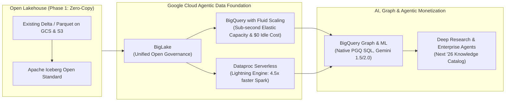
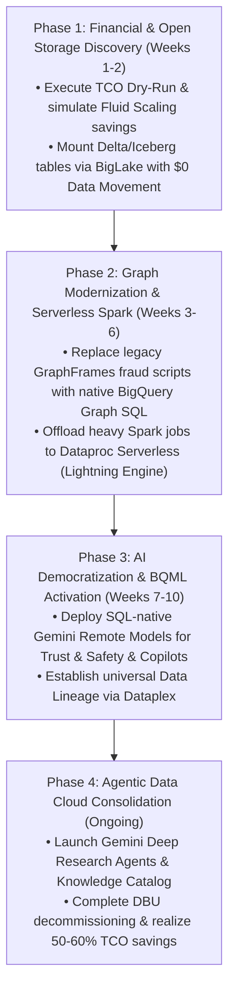
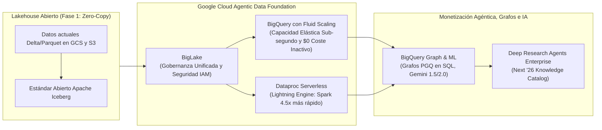
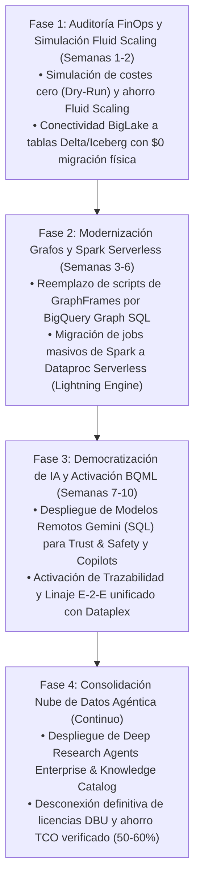

# Adevinta Data Foundation & Databricks Takeout Executive Narrative
**Building the Agentic Data Cloud with BigQuery Graph & Fluid Scaling for Europe's Leading Marketplaces**  
*Strategic Storytelling Framework for Architecture, FinOps, and Executive Engagement (English & Español)*

---

# PART 1: ENGLISH NARRATIVE

## 1. The Executive Hook: Adevinta's AI & Graph-Driven Marketplace Opportunity
As a leading force in European online classifieds—powering real estate, automotive, jobs, and generalist goods across platforms like *leboncoin, Kleinanzeigen, Mobile.de, Milanuncios,* and *InfoJobs*—Adevinta sits atop one of the continent's richest proprietary datasets. Billions of daily user behavior clicks, user-generated images, conversational chat logs, and interconnected user transaction networks represent a **massive data monetization and trust-building opportunity**. 

To capture the next decade of marketplace growth, Adevinta must transition from traditional, isolated predictive analytics to **Agentic AI Marketplaces**. This transition demands real-time conversational shopping copilots, instant multi-hop fraud ring interception, automated property/vehicle appraisals, and ultra-targeted ad monetization.

> [!IMPORTANT]
> **The Strategic Reality:** You cannot build world-class AI marketplaces on a complex, siloed, and financially opaque data infrastructure. To unleash Generative AI and Graph Analytics at scale, Adevinta needs a unified, serverless **Data & AI Foundation** that flexes compute instantaneously, eliminates vendor double-billing, and democratizes analytics across both data engineers and SQL analysts.

---

## 2. The Structural Barriers of Databricks: Why TCO Compounds While AI Lags
While Databricks served as a functional Big Data compute engine during the initial Spark wave, its architecture creates severe structural friction when scaling cutting-edge AI and graph workloads enterprise-wide:

* **Rigid Step-Scaling & Idle Compute Waste:** Databricks relies on an opaque cost model where customers pay twice: once for proprietary software licenses (**DBUs**) and once to the cloud provider for physical compute VMs. Step-scaling adds compute in coarse VM node blocks, creating queuing delays during morning traffic peaks on *Mobile.de* and paying for unproductive "ghost compute" during cooldown spin-downs.
* **The "Integration Tax" for Graph & GenAI:** In Databricks, identifying complex scam networks or feeding operational tables into modern Large Language Models (LLMs) forces engineers to extract data into specialized Spark libraries (GraphFrames), export to external graph databases (Neo4j), or use asynchronous format converters (**UniForm**)—increasing latency and operational vulnerability.
* **Governance & Security Fragmentation:** Relying on **Unity Catalog** forces Adevinta to manage a secondary, isolated security perimeter outside of Cloud IAM. This dual-administration increases auditing friction under rigorous European GDPR, EU Data Sovereignty, and emerging EU AI Act requirements.

---

## 3. The Google Cloud Solution: Next '26 Agentic Data Cloud, Fluid Scaling & Graph
By consolidating on Google Cloud's **BigQuery** and **Vertex AI**, Adevinta liberates its engineering teams from DevOps cluster management and moves directly to an **AI-Native, Agentic Data Foundation**.

### Key Technical & Strategic Pillars:
1. **BigQuery Fluid Scaling:** Revolutionary compute provisioning that dynamically flexes processing capacity slots in sub-second increments precisely calibrated to real-time query complexity and traffic surges. Unlike rigid VM step-scaling, Fluid Scaling ensures **zero cold starts, zero queuing bottlenecks during morning dealer peaks, and zero overprovisioning payment**.
2. **Native BigQuery Graph Analytics (SQL PGQ):** Stop exporting data to external graph databases or writing intricate Python GraphFrames scripts. With native Property Graph Queries (PGQ) in BigQuery, Adevinta SQL analysts can model nodes and edges over existing tables to execute multi-hop network traversals in milliseconds—uncovering organized scam rings and mapping relationships with **zero data movement**.
3. **Zero-Copy Open Lakehouse (BigLake & Apache Iceberg):** Eliminate migration fear. **Google BigLake** connects directly to existing Delta Lake and Apache Iceberg tables in current cloud buckets (GCS/AWS/Azure). Adevinta achieves unified column/row-level governance through **Cloud IAM & Dataplex** with **zero data duplication or ETL refactoring in Phase 1**.
4. **Serverless Spark Acceleration (Lightning Engine):** For vital existing Apache Spark pipelines, migrate execution effortlessly to **Dataproc Serverless**. Powered by the Cloud Next '26 **Lightning Engine for Apache Spark**, workloads run up to **4.5x faster than open-source alternatives with 2x better price-performance**, eradicating DBU licensing premiums entirely.
5. **The Next '26 Agentic Data Cloud:** Natively connects **Deep Research Agents in Gemini Enterprise** to structured BigQuery analytics and unstructured classifieds media. Backed by Dataplex's **Knowledge Catalog**, these agents construct a live semantic graph of Adevinta's marketplace metrics, allowing teams and user copilots to query complex business relationships with real-time verifiable citations.

---

## 4. Transformational Marketplace AI & Graph Use Cases for Adevinta
Deploying BigQuery Graph and Fluid Scaling directly accelerates Adevinta's core revenue and marketplace trust drivers:

| Marketplace Domain | AI & Graph Use Case | Google Cloud Foundation Enabler | Business Impact at Adevinta |
| :--- | :--- | :--- | :--- |
| **Trust & Safety** | **Organized Fraud Ring Interception** | **BigQuery Graph (PGQ) + Gemini Remote Models:** Single SQL pipeline executing multi-hop graph traversals to link shared IP addresses, device cookies, money transfer routing, and fraudulent image manipulation. | Eliminates manual moderation queues; dismantles coordinated scam rings on leboncoin and Milanuncios before listings go live. |
| **Ad Tech & Pricing** | **Algorithmic Dynamic Yield Optimization** | **BigQuery Fluid Scaling + BI Engine:** Sub-second elastic compute slot allocation that adjusts instantly to morning dealer programmatic ad bidding spikes. | Maximizes ad monetization ROI for commercial partners; optimizes visibility tier pricing without step-scaling cluster overprovisioning waste. |
| **User Experience** | **Conversational Buyer/Seller Copilots** | **BigQuery Vector Search + Vertex AI Gemini:** Real-time semantic matching across millions of unstructured automotive & real estate descriptions. | Boosts conversion rates; shortens time-to-sale with automated, high-converting listing descriptions and appraisals. |

---

## 5. The Databricks Takeout Roadmap: Proven Enterprise Impact
By moving from VM-coupled step-scaling clusters to BigQuery’s Fluid Scaling architecture, enterprise organizations (such as J.B. Hunt) have verified up to a **60% reduction in Total Cost of Ownership (TCO)** simply by eliminating idle cluster waste, step-scaling overprovisioning, and DBU double-billing.

---
---

# PARTE 2: NARRATIVA EN ESPAÑOL

## 1. El Gancho Ejecutivo: La Gran Oportunidad de IA y Grafos en los Marketplaces de Adevinta
Como líder indiscutible en clasificados digitales en Europa—impulsando sectores clave como el inmobiliario, motor, empleo y bienes de consumo en plataformas como *leboncoin, Kleinanzeigen, Mobile.de, Milanuncios* e *InfoJobs*—Adevinta posee uno de los activos de datos transaccionales y de comportamiento más valiosos del continente. Miles de millones de clics diarios, imágenes generadas por usuarios, chats interactivos y complejas redes transaccionales representan un **potencial masivo de monetización y confianza digital**.

Para liderar la próxima década de los marketplaces digitales, Adevinta debe evolucionar del aprendizaje automático (ML) predictivo tradicional hacia los **Marketplaces Agénticos impulsados por IA y Analítica de Grafos**. Esta transformación exige copilotos conversacionales en tiempo real para compradores, desmantelamiento instantáneo de redes complejas de fraude (Fraud Rings), tasaciones automáticas y optimización hiperpersonalizada del espacio publicitario (Ad Tech).

> [!IMPORTANT]
> **La Realidad Estratégica:** No es viable construir marketplaces de IA punteros sobre una infraestructura de datos compleja, fragmentada en silos y financieramente opaca. Para desplegar Inteligencia Artificial Generativa y Grafos a escala, Adevinta necesita una **Plataforma de Datos e IA elástica y 100% serverless** que adapte el cómputo instantáneamente, elimine la doble facturación y democratice la analítica avanzada.

---

## 2. Las Barreras Estructurales de Databricks: Costes Al Frente, IA a Dispersión
Aunque Databricks fue una solución viable para el procesamiento masivo durante la ola inicial de Apache Spark, su arquitectura actual genera serias fricciones estructurales al intentar escalar la IA y el análisis de grafos a nivel corporativo:

* **Escalado Rígido por Bloques (Step-Scaling) y Cómputo Fantasma:** Databricks opera bajo un modelo opaco donde el cliente paga dos veces: una por las licencias propietarias (**DBUs**) y otra al proveedor de nube por las máquinas virtuales (VMs). El escalado por bloques de servidores provoca cuellos de botellas en horas punta de *Mobile.de* y obliga a sobreaprovisionar hardware, pagando millones por inactividad.
* **El "Peaje de Integración" en Grafos e IA Generativa:** Su ecosistema depende críticamente de notebooks pesados. Analizar redes organizadas de fraude o alimentar LLMs obliga a extraer datos hacia librerías Spark complejas (GraphFrames), bases de datos de grafos externas (Neo4j) o traductores asíncronos lentos (**UniForm**), multiplicando la latencia y el riesgo operativo.
* **Fragmentación de Gobernanza y Cumplimiento:** Confiar en **Unity Catalog** obliga a Adevinta a mantener una segunda barrera de seguridad desconectada de Cloud IAM, dificultando el estricto cumplimiento del RGPD, la Soberanía de Datos en Europa y la Ley de IA de la UE (EU AI Act).

---

## 3. La Solución de Google Cloud: Next '26, Fluid Scaling y BigQuery Graph
Al consolidar su arquitectura en **BigQuery** y **Vertex AI**, Adevinta libera a sus equipos de ingeniería de datos de la gestión manual de infraestructura DevOps, dando el salto definitivo a un **Ecosistema de Datos e IA Agéntico, Elástico y Nativo**.

### Pilares Tecnológicos y Estratégicos Clave:
1. **BigQuery Fluid Scaling:** Innovación revolucionaria que asigna capacidad elástica de cómputo en fracciones de segundo y de forma milimétrica según la complejidad real de las consultas y picos de tráfico. A diferencia del escalado rígido de Databricks, Fluid Scaling garantiza **cero tiempos de arranque, cero colas de espera en horas punta de concesionarios y cero sobreaprovisionamiento pagado**.
2. **Analítica de Grafos Nativa en BigQuery (SQL PGQ):** Fin a la exportación de datos a bases de datos de grafos externas y a complejos scripts de GraphFrames en Python. Con Property Graph Queries (PGQ) en BigQuery, los analistas SQL de Adevinta pueden modelar nodos y aristas sobre las tablas actual para ejecutar recorridos de red en milisegundos—descubriendo redes organizadas de estafadores con **cero movimiento de datos**.
3. **Lakehouse Abierto sin Replicación de Datos (BigLake & Apache Iceberg):** Eliminación total del riesgo de migración en la fase inicial. **Google BigLake** consulta directamente las tablas existentes en formato Delta Lake o Apache Iceberg en sus buckets actual (GCS/AWS/Azure). Adevinta asegura gobernanza unificada a través de **Dataplex y Cloud IAM**, logrando **cero duplicación de datos sin necesidad de refactorizar ETLs en la Fase 1**.
4. **Aceleración Spark Serverless (Lightning Engine):** Para las cargas ETL de Spark críticas para el negocio, la ejecución se traslada directamente a **Dataproc Serverless**. Impulsado por la tecnología **Lightning Engine for Apache Spark** anunciada en Cloud Next '26, las tareas se ejecutan hasta **4.5 veces más rápido y con una eficiencia de coste-rendimiento 2x superior**, suprimiendo las licencias DBU.
5. **La Nube de Datos Agéntica (Next '26):** Vincula nativamente los **Deep Research Agents en Gemini Enterprise** con las tablas operativas de BigQuery y el contenido no estructurado de los clasificados. Apadrinados por el **Knowledge Catalog** de Dataplex, estos agentes autónomos construyen un grafo semántico dinámico de Adevinta, permitiendo a los usuarios internos y copilotos comerciales realizar análisis complejos y obtener respuestas precisas con citas verificables en tiempo real.

---

## 4. Casos de Uso Transformadores de IA y Grafos para Adevinta
El despliegue de BigQuery Graph y Fluid Scaling impacta de forma directa en el negocio de Adevinta, elevando la conversión, la seguridad y el ROI publicitario:

| Dominio de Marketplace | Caso de Uso de IA y Grafos | Motor Habilitador en Google Cloud | Impacto en Negocio y Ventajas para Adevinta |
| :--- | :--- | :--- | :--- |
| **Confianza y Seguridad (Trust & Safety)** | **Intercepción de Redes Organizadas de Fraude** | **BigQuery Graph (PGQ) + Modelos Remotos Gemini:** Consulta SQL única y recorridos de grafos que vinculan direcciones IP compartidas, cookies, cuentas bancarias y patrones fotográficos fraudulentos. | Reduce drásticamente los cuellos de botella de moderación manual; desmantela organizaciones fraudulentas en leboncoin y Milanuncios antes de publicarse. |
| **Monetización Publicitaria y Ad-Tech** | **Optimización Algorítmica Dinámica de Precios (Yield Optimization)** | **BigQuery Fluid Scaling + BI Engine:** Asignación elástica en sub-segundos que se adapta instantáneamente a picos matutinos de pujas publicitarias programáticas. | Maximiza el ROI publicitario de concesionarios y vendedores profesionales; optimiza la tarificación dinámica sin costes incurridos por escalado por bloques. |
| **Experiencia de Usuario** | **Copilotos Conversacionales para Comprar/Vender** | **BigQuery Vector Search + Vertex AI Gemini:** Búsqueda semántica instantánea entre millones de anuncios de motor, empleo e inmuebles sin latencia de red. | Aumenta radicalmente la tasa de conversión; reduce el tiempo de publicación mediante generación automática de descripciones atractivas y tasaciones precisas. |

---

## 5. Hoja de Ruta del Takeout de Databricks: Valor Realizable de Inmediato
Organizaciones empresariales de referencia (como J.B. Hunt) han verificado reducciones de hasta un **60% en su Coste Total de Propiedad (TCO)** al migrar desde modelos de clústeres rígidos de Databricks hacia la arquitectura elástica Fluid Scaling de BigQuery, erradicando los costes por inactividad y la doble facturación.

