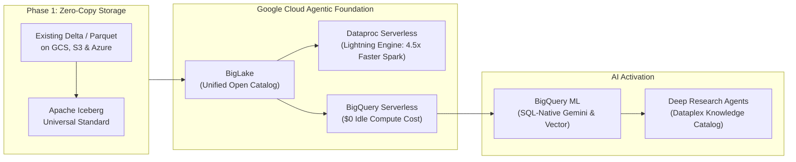
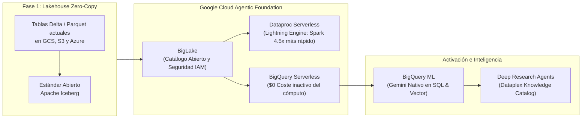

# Adevinta Data Foundation & Databricks Takeout Presentation Deck
**Powering Europe's Leading Marketplaces with the Next '26 Agentic Data Cloud**  
*Comprehensive Slide Deck Framework & Speaker Notes (English & Español)*

---

# PART 1: ENGLISH PRESENTATION SLIDES

## SLIDE 1: Title Slide
### **Building the Agentic Data Foundation for Europe's Leading Marketplaces**
**Transitioning Adevinta from Siloed Lakehouses to the AI-Native Data Cloud**

* **Target Audience:** Adevinta C-Level (FinOps, CTO, CIO), Enterprise Data Architects, & AI Engineering Leads
* **Key Focus:** Data Foundations for Generative AI, Zero-Copy Lakehouse, & Databricks TCO Optimization

---

## SLIDE 2: The Strategic Opportunity
### **Unleashing Adevinta’s Massive Marketplace Asset**
*From Static Classifieds to Proactive, AI-Driven Commerce*

* **The Continental Footprint:** Powering European leaders across automotive, real estate, employment, and classifieds (*leboncoin, Kleinanzeigen, Mobile.de, Milanuncios, InfoJobs*).
* **The Data Asset:** Billions of user interactions, real-time clickstreams, multimedia property/vehicle photos, and conversational buyer-seller chats.
* **The AI Mandate:** Winning the next decade of digital classifieds requires moving beyond historic dashboards and basic predictive ML toward **Agentic AI Marketplaces** and hyper-personalized user monetization.

> **Speaker Notes:** *"Welcome team. Adevinta sits on one of the most valuable behavioral and transaction datasets in Europe. But to capture the next wave of value—such as autonomous AI buyer assistants and instant multimodal pricing appraisals—your data platform cannot remain constrained by fragmented, complex infrastructure."*

---

## SLIDE 3: The Infrastructure Ceiling
### **Why Traditional Lakehouses (Databricks) Inflate TCO & Slow AI**
*Exposing Structural Inefficiencies & Cloud Double-Billing*

* **Double-Billing & Idle Compute Waste:** Customers pay twice—for Databricks licenses (**DBUs**) and underlying cloud VMs. 2-to-7-minute cluster warm-up lags and idle termination spin-downs drain millions in un-productive "ghost compute."
* **The Generative AI "Integration Tax":** Notebook-centric Spark architectures force data engineers to extract structured warehouse data into complex, custom pipelines or asynchronous converters (**UniForm**) just to invoke modern LLMs.
* **Governance Silos:** Managing **Unity Catalog** alongside native Cloud IAM creates administrative duplication, hindering seamless compliance under EU Data Sovereignty, GDPR, and the EU AI Act.

> **Speaker Notes:** *"When we analyze why legacy platform invoices continue to climb without proportional AI acceleration, we see structural flaws. Databricks forces you into an opaque compound cost model where you pay for DBUs on top of VMs, while requiring code-heavy bridges just to expose corporate data to LLMs."*

---

## SLIDE 4: The Google Cloud Solution
### **The Next '26 Agentic Data Cloud architecture**
*A Fully Serverless, Zero-Copy Enterprise Foundation*

* **Zero-Copy Lakehouse:** **Google BigLake** queries existing Delta Lake and Apache Iceberg files directly in current buckets with unified row/column IAM governance—**zero physical data movement required**.
* **Serverless Spark Acceleration:** **Dataproc Serverless** powered by the Next '26 **Lightning Engine for Apache Spark** runs up to **4.5x faster** than open-source alternatives with **2x better price-performance**, eliminating cluster administration and DBU licensing premiums entirely.
* **True Serverless Elasticity:** Multi-tenant compute pools with **$0 cost at rest**, eliminating idle compute bills and cold starts.

> **Speaker Notes:** *"Google Cloud solves this through our Next '26 Agentic Data Cloud. We don't ask you to undertake a risky migration; with BigLake, we query your existing Delta Lake and Iceberg tables directly in your storage buckets with zero duplication. And for your existing Spark ETLs, Dataproc Serverless with our new Lightning Engine executes 4.5x faster with zero cluster management and zero DBU fees."*

---

## SLIDE 5: Unified Data-To-AI Superhighway
### **Democratizing Advanced AI Across SQL & Data Teams**
*No Data Egress. Native Multimodal AI Directly at the Storage Layer.*

* **BigQuery ML & Remote Models:** SQL-first analysts and engineers can operationalize state-of-the-art **Gemini 1.5/2.0 LLMs**, multi-modal vision classifiers, and automated forecasting using simple, declarative SQL (`ML.GENERATE_TEXT`).
* **Instant Vector Search:** Build real-time semantic recommendation indices directly inside BigQuery over millions of listing descriptions and product photos.
* **Next '26 Deep Research Agents:** Deploy autonomous agents grounded in Dataplex's **Knowledge Catalog** to reason across structured operational tables and unstructured marketplace media with real-time verifiable citations.

> **Speaker Notes:** *"Instead of exporting data out of your secure warehouse into experimentation notebooks, Google brings the AI directly to the data. Any domain analyst at Adevinta can invoke Gemini large language models or generate vector embeddings over listing data using standard SQL, dramatically accelerating time-to-market."*

---

## SLIDE 6: Adevinta AI Marketplace Use Cases
### **Driving ROI Across Core Marketplace Drivers**
*High-Impact Enhancements Tailored for Classifieds Platforms*

| Marketplace Domain | AI Innovation | Powered by Google Cloud Foundation | Adevinta Business Impact |
| :--- | :--- | :--- | :--- |
| **Conversational Commerce** | **Autonomous Buyer/Seller Copilots** | **BigQuery Vector Search + Gemini:** Sub-second semantic search matching user intent across millions of automotive & real estate listings. | Maximizes conversion rates; shortens listing creation time with automated descriptions & price estimates. |
| **Trust & Safety** | **Multimodal Fraud & Scam Interception** | **BigQuery ML Remote Models:** Consolidated SQL pipeline analyzing image manipulation, chat sentiment, and IP clickstream telemetry. | Eliminates manual review bottlenecks; protects marketplace brand trust before fraudulent listings go live. |
| **Ad Tech & Monetization** | **Algorithmic Dynamic Yield Pricing** | **BigQuery Serverless Slots + Capacitor:** Real-time analytical aggregations without query queuing or data skew failures. | Optimizes advertising revenue and premium visibility pricing for commercial dealers and sellers. |

> **Speaker Notes:** *"Here is how this foundation translates into bottom-line marketplace growth. Whether it is powering real-time conversational shopping copilots on Mobile.de, intercepting fraudulent real estate scams on leboncoin via multimodal SQL vision models, or calculating real-time dynamic ad bidding, BigQuery and Vertex AI power it without friction."*

---

## SLIDE 7: Proven Takeout Roadmap & FinOps Value
### **A Low-Risk, High-Impact 4-Phase Transition Strategy**
*Eliminate Idle Spend and Achieve up to 60% TCO Savings (e.g., J.B. Hunt Benchmark)*

1. **Phase 1: Financial Discovery & BigLake Connectivity (Weeks 1–2):** Run zero-cost BigQuery dry-run evaluations (`--dry_run`); attach existing GCS/S3 Delta tables via BigLake with **$0 data migration cost**.
2. **Phase 2: Serverless Spark Offloading (Weeks 3–6):** Move heavy Spark processing to Dataproc Serverless (Lightning Engine) and retire interactive Databricks SQL Warehouses.
3. **Phase 3: AI Democratization & Lineage (Weeks 7–10):** Activate SQL-native Gemini models for Trust & Safety and Copilot teams; configure unified Dataplex lineage from ingestion to Looker dashboards.
4. **Phase 4: Agentic Data Cloud Consolidation (Ongoing):** Launch enterprise Deep Research Agents; complete DBU license decommissioning and lock in **50%–60% structural cloud TCO savings**.

> **Speaker Notes:** *"Our transition roadmap is designed to prove financial value within the first fourteen days. We mount your open tables without copying a single byte, offload high-cost Spark workloads to serverless execution, and systematically decommission expensive DBU licenses—emulating proven benchmarks where enterprises cut TCO by up to 60% while accelerating AI adoption."*

---

## SLIDE 8: Next Steps & Call to Action
### **Validating the Value at Adevinta**
*Recommended Initial Engagements for Architecture & FinOps Teams*

* **1. FinOps Billing Audit & Dry-Run Workshop:** Schedule a 2-week non-intrusive billing assessment to quantify exact spend lost to Databricks DBUs, idle cluster warm-up lags, and network egress.
* **2. 5-Day Zero-Copy BigLake Proof of Concept:** Mount a representative subset of Adevinta’s Delta/Iceberg tables in GCS/AWS directly into BigQuery to validate blazing-fast BI reads without ETL rewriting.
* **3. SQL-Native GenAI Showcase:** Build a live, 30-minute prototype demonstration using BigQuery ML to run Gemini vision/text fraud detection on sample marketplace listing data.

> **Speaker Notes:** *"To move forward, we recommend three actionable zero-risk engagements: a short FinOps billing workshop to quantify your current DBU waste, a 5-day zero-copy BigLake technical proof of concept, or a live 30-minute showcase running Gemini multimodal fraud detection directly in standard SQL. Where would you like to begin?"*

---
---

# PARTE 2: DIAPOSITIVAS EN ESPAÑOL

## DIAPOSITIVA 1: Diapositiva de Título
### **Construyendo la Fundación de Datos Agéntica para los Marketplaces Líderes de Europa**
**Transicionando las Arquitecturas de Adevinta hacia la Nube de Datos e IA de Nueva Generación**

* **Audiencia Objetivo:** Dirección Ejecutiva y FinOps de Adevinta (CTO, CIO, CFO), Arquitectos de Datos Empresariales y Líderes de Ingeniería de IA
* **Enfoque Clave:** Plataforma Fundacional para IA Generativa, Lakehouse Abierto sin Replicación de Datos (Zero-Copy) y Optimización de Coste Total de Propiedad (TCO) frente a Databricks

---

## DIAPOSITIVA 2: La Oportunidad Estratégica
### **Potenciando el Masivo Activo de Datos de Adevinta**
*De Anuncios Clasificados Estáticos al Comercio Agéntico e Inteligente*

* **La Huella Continental:** Motores tecnológicos detrás de marcas líderes europeas en motor, inmobiliario, empleo y consumo (*leboncoin, Kleinanzeigen, Mobile.de, Milanuncios, InfoJobs*).
* **El Activo de Datos:** Miles de millones de eventos de comportamiento, clics en tiempo real, fotografías multimedia de usuarios y chats interactivos de compra y venta.
* **El Mandato de la IA:** Liderar la próxima década de los marketplaces digitales requiere evolucionar más allá del BI tradicional y el ML predictivo aislado para crear **Marketplaces Agénticos impulsados por IA**, acelerando la conversión y la monetización publicitaria.

> **Notas del Orador:** *"Bienvenidos a todos. Adevinta administra uno de los activos de datos transaccionales y de usuario más ricos y exclusivos de Europa. Pero para capitalizar la nueva era del comercio digital—implementando asistentes de compra autónomos y tasaciones instantáneas—su arquitectura de datos no puede verse frenada por una infraestructura fragmentada y costosa."*

---

## DIAPOSITIVA 3: El Techo de Infraestructura
### **Por Qué los Lakehouses Tradicionales (Databricks) Inflan el TCO y Frenan la IA**
*Análisis de Ineficiencias Estructurales y la Doble Facturación en Cloud*

* **Doble Facturación y Cómputo Fantasma:** En Databricks se paga por duplicado: por las licencias propietarias (**DBUs**) y por las máquinas virtuales (VMs) del proveedor de nube. Los tiempos de arranque de clústeres (*cold starts* de 2 a 7 minutos) y la inactividad antes del apagado consumen presupuestos millonarios sin procesar información productiva.
* **El "Peaje de Integración" en IA Generativa:** Su arquitectura centrada en notebooks obliga a los equipos de ingeniería a construir complejas canalizaciones de extracción o usar traductores asíncronos lentos (**UniForm**) para alimentar modelos avanzados de lenguaje (LLMs) con datos corporativos.
* **Silos de Gobernanza:** Depender de **Unity Catalog** en lugar del sistema IAM nativo del cloud genera una duplicidad de administración que encarece y complica el cumplimiento regulatorio europeo (RGPD, Soberanía de Datos y Ley de IA de la UE).

> **Notas del Orador:** *"Cuando analizamos por qué la factura de la plataforma de datos actual sigue creciendo sin ir acompañada de una agilidad equivalente en IA, descubrimos fallos estructurales. Databricks impone un modelo de costes compuesto opaco donde pagan DBUs sobre VMs, y además requiere canalizaciones pesadas y redundantes para conectar datos operativos con IA Generativa."*

---

## DIAPOSITIVA 4: La Solución de Google Cloud
### **Arquitectura 'Agentic Data Cloud' (Novedades Next '26)**
*Una Fundación Empresarial 100% Serverless y sin Duplicación de Datos*

* **Lakehouse Zero-Copy:** **Google BigLake** consulta directamente las tablas actuales en formato Delta Lake o Apache Iceberg en los buckets de almacenamiento existentes (GCS/AWS/Azure) con seguridad IAM unificada por columna y fila—**cero movimiento de datos ni migración ETL en Fase 1**.
* **Aceleración Spark Serverless:** **Dataproc Serverless** equipado con el motor **Lightning Engine for Apache Spark** anunciado en Cloud Next '26 se ejecuta hasta **4.5 veces más rápido** con una **eficiencia de coste-rendimiento 2x superior**, eliminando la administración de clústeres y el coste de licencias DBU.
* **Elasticidad Serverless Real:** Pools de cómputo multi-tenant con **coste literal de $0 en reposo**, suprimiendo los tiempos de arranque (*cold starts*) y el desperdicio financiero.

> **Notas del Orador:** *"Google Cloud resuelve este dilema estructural con la arquitectura 'Agentic Data Cloud' de Next '26. No proponemos una migración traumática: con BigLake conectamos directamente las tablas Delta e Iceberg en sus buckets actuales sin copiar un solo byte. Y para las tareas masivas de Spark actuales, Dataproc Serverless las procesa hasta 4.5 veces más rápido sin gestionar clústeres ni pagar licencias DBU."*

---

## DIAPOSITIVA 5: La Superautopista Integrada de Datos e IA
### **Democratizando la IA Avanzada entre Analistas y Científicos de Datos**
*Sin Exportar Datos: Inteligencia Artificial Multimodal Nativa en el Almacén.*

* **BigQuery ML y Modelos Remotos:** Los analistas de negocio y equipos SQL pueden ejecutar modelos punteros **Gemini 1.5/2.0**, clasificadores visuales multimodales y pronósticos de series temporales usando sintaxis SQL estándar sencilla (`ML.GENERATE_TEXT`).
* **Búsqueda Vectorial Instantánea (Vector Search):** Construya índices de recomendación semántica en tiempo real directamente en BigQuery sobre millones de descripciones de inmuebles, vehículos o empleos.
* **Agentes 'Deep Research' (Next '26):** Despliegue agentes autónomos apadrinados por el **Knowledge Catalog** de Dataplex capaces de razonar sobre tablas operativas estructuradas e imágenes no estructuradas del marketplace, aportando respuestas precisas con citas verificables en tiempo real.

> **Notas del Orador:** *"En lugar de exportar continuamente información sensible de las bases de datos corporativas a entornos de experimentación, Google Cloud lleva la inteligencia directamente a los datos. Cualquier analista de negocio en Adevinta puede invocar LLMs de Gemini o realizar búsquedas vectoriales semánticas con sentencias básicas de SQL, multiplicando la velocidad de innovación de los equipos."*

---

## DIAPOSITIVA 6: Casos de Uso Transformadores de IA para Adevinta
### **Generando Retorno (ROI) y Valor Directo en el Ecosistema de Clasificados**
*Soluciones Punteras Diseñadas específicamente para Marketplaces*

| Dominio del Marketplace | Innovación Habilitada con Inteligencia Artificial | Motor Habilitador en Google Cloud | Impacto en Negocio para Adevinta |
| :--- | :--- | :--- | :--- |
| **Comercio Conversacional y UX** | **Copilotos Autónomos de Compra y Venta** | **BigQuery Vector Search + Gemini:** Búsqueda semántica instantánea interpretando la intención real entre millones de anuncios inmobiliarios, motor y empleo. | Dispara la tasa de conversión; acorta el tiempo de publicación produciendo descripciones óptimas y tasaciones automáticas de alta precisión. |
| **Confianza y Seguridad (Trust & Safety)** | **Intercepción Multimodal y Prevención de Fraude** | **Modelos Remotos BigQuery ML:** Consulta SQL unificada que detecta manipulación en fotografías de anuncios, semántica fraudulenta en chats y anomalías web/IP. | Elimina cuellos de botella de revisión manual; blinda la reputación de las marcas filtrando estafas antes de publicarse online. |
| **Monetización Publicitaria (Ad-Tech)** | **Algoritmos Dinámicos de Optimización de Precios** | **BigQuery Serverless Slots + Compresión Capacitor:** Agregaciones analíticas programáticas en sub-segundos sin fallos por desequilibrio o colapso del nodo. | Maximiza el rendimiento publicitario de concesionarios y anunciantes profesionales; ajusta de forma dinámica precios de visibilidad premium. |

> **Notas del Orador:** *"Aquí es donde nuestra arquitectura impulsa directamente los resultados de Adevinta. Ya sea integrando asistentes de búsqueda semántica en Mobile.de, interceptando fraude y estafas en inmuebles de leboncoin evaluando en SQL las fotografías e historiales del vendedor en milisegundos, o calculando el precio óptimo del inventario publicitario online sin colgar los clústeres."*

---

## DIAPOSITIVA 7: Hoja de Ruta Probada para el Takeout de Databricks
### **Estrategia de 4 Fases con Riesgo Minimizado e Impacto Inmediato**
*Erradique Cargas Inactivas y Logre Ahorros TCO Verificados de hasta un 60% (ej. J.B. Hunt)*

1. **Fase 1: Auditoría FinOps y Conexión Lakehouse (Semanas 1–2):** Evaluaciones gratuitas de coste mediante simulación (`--dry_run`) y conexión BigLake sobre tablas Delta/Iceberg con **coste $0 de duplicación o migración física**.
2. **Fase 2: Despliegue Spark Serverless (Semanas 3–6):** Traslado de cargas masivas de Spark hacia Dataproc Serverless (Lightning Engine) y apagado progresivo de SQL Warehouses de Databricks.
3. **Fase 3: Democratización de IA y Trazabilidad (Semanas 7–10):** Activación de Modelos Remotos Gemini (SQL) para equipos de Trust & Safety; configuración de linaje E2E automatizado en Dataplex hasta cuadros Looker.
4. **Fase 4: Consolidación 'Agentic Data Cloud' (Continuo):** Lanzamiento corporativo de Deep Research Agents; desconexión final de licencias DBU afianzando ahorros estructurales de **50% a 60% en TCO cloud**.

> **Notas del Orador:** *"El mapa de ruta para este reemplazo está diseñado para demostrar impacto financiero real en los primeros 14 días. Conectamos sus tablas abiertas sin mover datos, aceleramos el cómputo masivo en Spark eliminando servidores y cancelamos progresivamente las licencias DBU de Databricks—replicando casos verificados de reducciones corporativas de TCO corporativo de hasta el 60%."*

---

## DIAPOSITIVA 8: Próximos Pasos y Acuerdos de Acción
### **Validando de Forma Segura el Valor en el Ecosistema de Adevinta**
*Iniciativas Iniciales Recomendadas para los Equipos de Arquitectura y FinOps*

* **1. Auditoría de Facturación FinOps y Taller de Dry-Run (Coste $0):** Sesión de trabajo no intrusiva de 2 semanas para identificar cuantitativamente el gasto actual evitable en licencias DBU, tiempos de calentamiento de clústeres y tasas de red (egress).
* **2. Prueba de Concepto (POC) de 5 Días sobre BigLake (Zero-Copy):** Conexión de una muestra representativa de tablas Delta/Iceberg en los buckets GCS/AWS actuales para verificar rendimiento BI de alta velocidad en BigQuery sin modificar una sola línea ETL.
* **3. Sesión Demostrativa (Demo) de IA Nativa en SQL (30 min):** Construcción en vivo de un prototipo usando BigQuery ML con modelos remotos Gemini para inspección visual y textual de fraude sobre datos simulados del marketplace.

> **Notas del Orador:** *"Para avanzar de manera firme y sin riesgo operativo para Adevinta, proponemos iniciar una de estas tres vías eficaces de validación: un análisis FinOps para cuantificar pérdidas por DBUs inactivos, una prueba técnica de 5 días con BigLake y cero duplicación de datos, o una demostración práctica de 30 minutos de detección de fraude en SQL con Gemini. ¿Cuál de ellas prefieren programar para la próxima semana?"*
